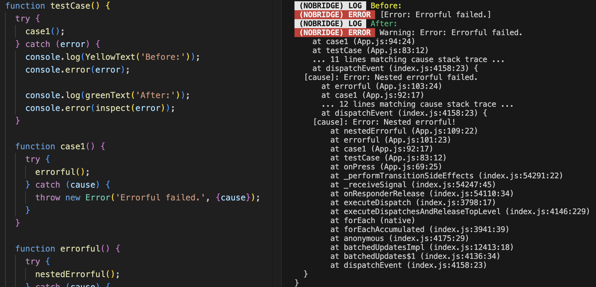

<h1 align="center">util-inspect-isomorphic 🔍</h2>

# About

A dependency-free isomorphic port of the Node.js API [require("node:util").inspect()](https://nodejs.org/api/util.html#utilinspectobject-options). Works on any ES6 JS runtime, as it has no dependency on V8 or Node.js. Can be used in the browser, in React Native, etc.

# Usage

Install as follows:

```sh
npm install util-inspect-isomorphic
```

Use just like the original (see the official Node.js [docs](https://nodejs.org/api/util.html#utilinspectobject-options) for full details):

```js
import { inspect } from "util-inspect-isomorphic";

// Serialise Errors with cause:
console.error(inspect(new Error("Outer", { cause: new Error("Inner") })));

// Inspect deeply-nested objects:
console.log(inspect({ a: { b: { c: { d: {} } } } }), { depth: null });

// Print with colours:
console.log(inspect(["wow", new Date(), true], { colors: true }));

// Insert an underscore between every 3 digits:
console.log(inspect(1000000000, { numericSeparator: true }));
```

For an example, see how we can use this in React Native to log `Error.cause` properly:



# Engine support

Requires ES6 and ESM support (or a bundler that can downlevel them).

# Differences from the original

This library is a port of the Node.js core code in [lib/internal/util/inspect.js](https://github.com/nodejs/node/blob/main/lib/internal/util/inspect.js) (and any dependent files) as it was in `main` on June 2025, so approximately Node.js v24.1.0. Here are the main compromises that had to be made in the port:

- `Proxy` types cannot be inspected, so `showProxy: true` has no effect. Instead of the `Proxy` itself, the `Proxy` target will be inspected.
- For external (cross-realm, etc.) types, we cannot print the memory address, so just print `[External: <address unknown>]`.
- Limited `Promise` introspection – we can't tell whether it is `<pending>`, `<rejected>`, or resolved, so we write `<uninspectable>` instead.
- Type inspection can be fooled, as it doesn't use engine-level introspection.
- Not all types of [TypedArray](https://developer.mozilla.org/en-US/docs/Web/JavaScript/Reference/Global_Objects/TypedArray) get special handling. Namely `Float16Array`, `BigInt64Array`, and `BigUint64Array`.
- Does not apply special colour-highlighting to stack trace lines that enter `node_modules` or Node.js core modules.

# Sources

Here's a file-by-file summary of what was adapted from the Node.js internals or other projects:

- [src/index.ts](./src/index.ts):
  - [lib/internal/util.js](https://github.com/nodejs/node/blob/main/lib/internal/util.js)
- [src/inspect.ts](./src/inspect.ts):
  - [lib/internal/util/inspect.js](https://github.com/nodejs/node/blob/main/lib/internal/util/inspect.js)
- [src/internal-assert.ts](./src/internal-assert.ts):
  - [lib/internal/assert.js](https://github.com/nodejs/node/blob/main/lib/internal/assert.js)
- [src/internal-errors.ts](./src/internal-errors.ts):
  - [lib/internal/errors.js](https://github.com/nodejs/node/blob/main/lib/internal/errors.js)
- [src/internal-util-types.ts](./src/internal-util-types.ts):
  - [lib/internal/util/types.js](https://github.com/nodejs/node/blob/main/lib/internal/util/types.js)
  - Some code adapted from [node-inspect-extracted](https://github.com/hildjj/node-inspect-extracted/blob/main/src/internal/util/types.js), as per the code comments.
- [src/internal-util.ts](./src/internal-util.ts):
  - [lib/internal/util.js](https://github.com/nodejs/node/blob/main/lib/internal/util.js)
- [src/internal-validators.ts](./src/internal-validators.ts):
  - [lib/internal/validators.js](https://github.com/nodejs/node/blob/main/lib/internal/validators.js)
- [src/primordials.ts](./src/primordials.ts):
  - [node-primordials](https://github.com/isaacs/node-primordials/blob/main/src/index.ts), itself a TypeScript port of [lib/internal/per_context/primordials.js](https://github.com/nodejs/node/blob/main/lib/internal/per_context/primordials.js)
- [src/node-util.ts](./src/node-util.ts):
  - [src/node_util.cc](https://github.com/nodejs/node/blob/main/src/node_util.cc)
  - Some code adapted from [node-inspect-extracted](https://github.com/hildjj/node-inspect-extracted/blob/main/src/util.js), as per the code comments.

# See also

I found out about the excellent [node-inspect-extracted](https://github.com/hildjj/node-inspect-extracted) only after largely finishing this port. There are a few differences between our approaches.

- `node-inspect-extracted`:
  - is a CommonJS library, written in JavaScript.
  - is designed to be easy to keep up to date with upstream, whereas `util-inspect-isomorphic` is a one-time snapshot.
  - has some [tests](https://github.com/hildjj/node-inspect-extracted/tree/main/test).
- `util-inspect-isomorphic`:
  - is a port to ESM, written in TypeScript.
  - is confirmed to work in React Native.
    - _I found that I had to change calls such as `const { Object } = primordials` to `primordials.Object` to get it to run. I can't be sure whether it was a Hermes runtime issue or a Metro bundling issue._
  - is untested. Use at your own risk!

# Contributing

```sh
# Clone the repo
git clone git@github.com:shirakaba/util-inspect-isomorphic.git
cd util-inspect-isomorphic

# Install the dev dependencies
npm install

# Build the code from TypeScript to JavaScript
npm run build

# Test the code (e.g. by making a new script)
node ./scripts/test.js
```
